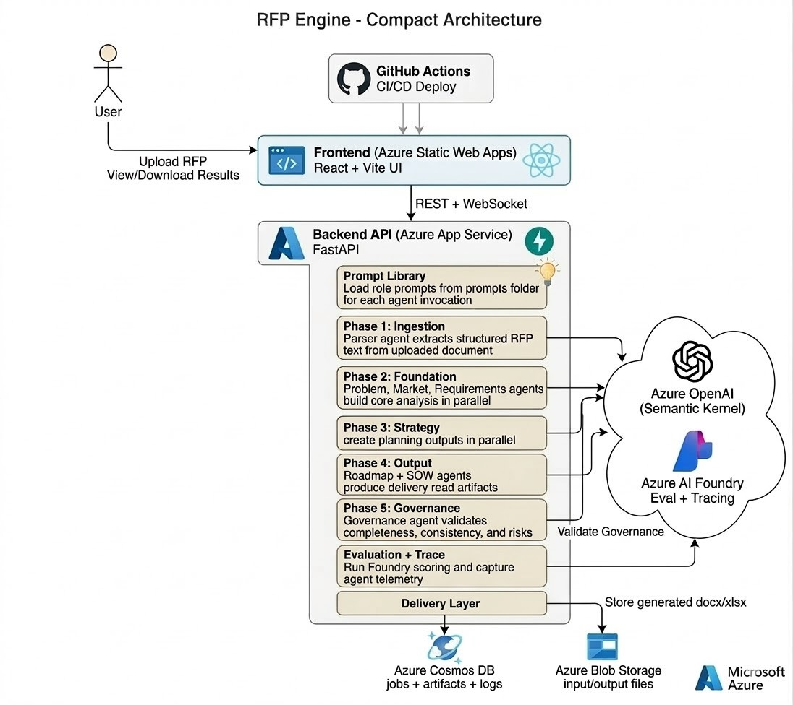

# RFP Strategy Engine

### Autonomous Multi-Agent AI System for Enterprise Product Strategy

> Upload a 50+ page enterprise RFP and receive a complete suite of product strategy and delivery artifacts — problem framing, market research, prioritized backlog, KPIs, roadmap, SOW, and more — all validated by an AI governance layer and scored by Azure AI Foundry.

[](https://github.com/microsoft/semantic-kernel)
[](https://azure.microsoft.com/en-us/products/ai-services/openai-service)
[](https://azure.microsoft.com/en-us/products/ai-studio)
[](https://www.python.org/)
[](https://react.dev/)
[](LICENSE)

### [Click here to access the live app on Azure](https://mango-plant-0f448b800.1.azurestaticapps.net)

### [Click here to view the demo of the app](https://drive.google.com/file/d/1CBZ7nzTorOZOfwrsy8L8QMsM7HH7R7ux/view?usp=sharing)

---

## Demo

https://github.com/user-attachments/assets/98eef933-fffe-4193-896a-d6015c5e3dad

---

## Table of Contents

- [Demo](#demo)
- [The Problem](#the-problem)
- [Our Solution](#our-solution)
- [Architecture](#architecture)
  - [System Architecture](#system-architecture)
  - [Phased Multi-Agent Pipeline](#phased-multi-agent-pipeline)
  - [Shared Context Pattern](#shared-context-pattern)
- [Artifacts Generated](#artifacts-generated)
- [Tech Stack](#tech-stack)
- [Frontend Experience](#frontend-experience)
- [Azure AI Foundry Integration](#azure-ai-foundry-integration)
- [Downloadable Exports](#downloadable-exports)
- [Quick Start](#quick-start)
  - [Prerequisites](#prerequisites)
  - [Backend Setup](#backend-setup)
  - [Frontend Setup](#frontend-setup)
- [Configuration](#configuration)
- [API Reference](#api-reference)
- [Testing](#testing)
- [CI/CD Pipeline](#cicd-pipeline)
- [Project Structure](#project-structure)
- [Why This Project Deserves to Win](#why-this-project-deserves-to-win)
- [Team](#team)
- [License](#license)

---

## The Problem

Enterprise organizations receive and respond to hundreds of RFPs (Requests for Proposal) each year. Transforming a dense, 50–200 page RFP document into actionable product strategy artifacts is a **manual, error-prone process** that typically takes product teams **days to weeks**. Key challenges include:

- **Information overload** — Critical requirements are buried across dozens of sections.
- **Inconsistent analysis** — Different team members extract different insights from the same document.
- **Siloed artifacts** — Requirements, features, personas, roadmaps, and SOWs are created independently with no traceability.
- **No quality assurance** — There is no systematic way to validate that all RFP requirements are addressed across every artifact.

---

## Our Solution

**RFP Strategy Engine** is an autonomous, multi-agent AI system that transforms raw enterprise RFP documents into a complete, cross-validated suite of 11 product strategy and delivery artifacts — in minutes instead of weeks.

The system orchestrates **10 specialized AI agents** across **5 execution phases** using **Microsoft Semantic Kernel**, with parallel execution within phases for maximum throughput. Every generated artifact is:

1. **Traceable** — linked back to source RFP sections and cross-referenced with other artifacts.
2. **Validated** — a dedicated Governance Agent performs 10 quality checks scoring completeness, consistency, and risk.
3. **Scored** — Azure AI Foundry evaluators provide objective relevance, coherence, and groundedness metrics.
4. **Observable** — full OpenTelemetry tracing exports every agent execution span to the Azure AI Foundry portal.
5. **Exportable** — all artifacts are available as styled Excel (.xlsx) and Word (.docx) documents.

---

## Architecture

### System Architecture



```text
User uploads RFP (PDF/DOCX/TXT)
        │
   Azure Blob Storage (rfp-uploads)
        │
   FastAPI Backend (async) ─── WebSocket ──► React Frontend (real-time progress)
        │
 ┌──────┴──────────────────────────────────────────┐
 │     Phased Multi-Agent Pipeline (Semantic Kernel) │
 │  Phase 1: Ingestion        (1 agent, sequential)  │
 │  Phase 2: Foundation        (3 agents, parallel)   │
 │  Phase 3: Strategy & Metrics (3 agents, parallel)  │
 │  Phase 4: Output Generation  (2 agents, parallel)  │
 │  Phase 5: Validation        (1 agent, sequential)  │
 └──────┬──────────────────────────────────────────┘
        │
 Azure AI Foundry (Evaluation + OpenTelemetry Tracing)
        │
 File Export Service ──► Azure Blob Storage (generated-artifacts)
        │                 (5 xlsx + 4 docx per job)
 Azure Cosmos DB (serverless) ── artifacts + job metadata + agent memory
        │
 REST + WebSocket APIs ──► React SPA (results dashboard with 13 tabs)
```

### Phased Multi-Agent Pipeline

The pipeline executes **10 agents** across **5 phases**, with **parallel execution within phases** where dependencies allow. All agents share a single **Microsoft Semantic Kernel** instance backed by **Azure OpenAI GPT-4o**.

| Phase | Name | Agents | Execution |
|-------|------|--------|-----------|
| **1** | Ingestion | RFP Parser Agent | Sequential |
| **2** | Foundation | Problem Statement Agent, Market Research Agent, Requirements Agent | **Parallel** |
| **3** | Strategy & Metrics | Feature Planning Agent, Success Metrics (KPI) Agent, Persona & Research Agent | **Parallel** |
| **4** | Output Generation | Product Roadmap Agent, SOW Generation Agent | **Parallel** |
| **5** | Validation | Governance Agent | Sequential |

```
                     ┌──────────────────┐
      Raw Text ─────►│  Parser Agent    │ Phase 1 (Sequential)
                     └────────┬─────────┘
                              │
              ┌───────────────┼───────────────┐
              ▼               ▼               ▼
     ┌────────────┐  ┌──────────────┐  ┌─────────────┐
     │  Problem   │  │   Market     │  │Requirements │  Phase 2 (Parallel)
     │ Statement  │  │  Research    │  │Intelligence │
     └─────┬──────┘  └──────┬───────┘  └──────┬──────┘
           │                │                  │
           └───────────────┬┘                  │
              ┌────────────┼──────────────┐    │
              ▼            ▼              ▼    │
     ┌────────────┐  ┌──────────┐  ┌──────────┤
     │  Feature   │  │ Success  │  │ Persona  │  Phase 3 (Parallel)
     │ Planning   │  │ Metrics  │  │& Research│
     └─────┬──────┘  └────┬─────┘  └────┬─────┘
           │               │              │
           └───────────────┼──────────────┘
              ┌────────────┴────────────┐
              ▼                         ▼
     ┌────────────────┐       ┌────────────────┐
     │    Product     │       │      SOW       │  Phase 4 (Parallel)
     │    Roadmap     │       │   Generation   │
     └───────┬────────┘       └───────┬────────┘
             │                        │
             └────────────┬───────────┘
                          ▼
                 ┌────────────────┐
                 │  Governance    │  Phase 5 (Sequential)
                 │    Agent       │
                 └───────┬────────┘
                         ▼
                  Final Artifacts
                  + Foundry Evaluation
                  + Excel/Word Exports
```

### Shared Context Pattern

All agents communicate through a **shared context dictionary** — each agent reads from prior outputs and writes its own:

```python
context = {
    "raw_text": "...",                # Input
    "parsed_rfp": {...},              # Phase 1: Parser Agent
    "problem_statement": {...},       # Phase 2: Problem Statement Agent
    "market_research": {...},         # Phase 2: Market Research Agent
    "requirements": [...],            # Phase 2: Requirements Agent
    "features": [...],                # Phase 3: Feature Planning Agent
    "success_metrics": {...},         # Phase 3: KPI Agent
    "personas": [...],                # Phase 3: Persona Agent
    "interview_questions": [...],     # Phase 3: Persona Agent
    "roadmap": {...},                 # Phase 4: Roadmap Agent
    "sow": {...},                     # Phase 4: SOW Agent
    "governance_report": {...},       # Phase 5: Governance Agent
}
```

---

## Artifacts Generated

| # | Artifact | Description | Agent |
|---|----------|-------------|-------|
| 1 | **Parsed RFP** | Structured sections (scope, requirements, deliverables, timeline, etc.) + metadata (organization, budget, dates) | RFP Parser Agent |
| 2 | **Problem Statement** | Core problem articulation with current/desired state analysis, gap analysis, stakeholder mapping, business impact, and success vision | Problem Statement Agent |
| 3 | **Market Research** | Industry context, market trends (with impact ratings), competitive landscape, technology maturity assessments, risk factors, and strategic recommendations | Market Research Agent |
| 4 | **Structured Requirements** | All functional, non-functional, constraint, and compliance requirements — categorized and MoSCoW-prioritized with source traceability | Requirements Agent |
| 5 | **Feature Backlog** | Prioritized features (P0–P3) with user stories, acceptance criteria (Given/When/Then), priority scores, and requirement linkage | Feature Planning Agent |
| 6 | **Success Metrics & KPIs** | SMART KPIs across 4 categories (business, technical, UX, operational), OKRs with key results, and a measurement framework (reporting cadence, dashboards, alerting) | Success Metrics Agent |
| 7 | **User Personas** | 4–6 realistic stakeholder personas with roles, goals, pain points, and context derived from the RFP | Persona & Research Agent |
| 8 | **Interview Questions** | 10–15 targeted questions (discovery, validation, prioritization) mapped to specific personas with rationale | Persona & Research Agent |
| 9 | **Product Roadmap** | Phased roadmap (3–4 phases) with milestones linked to KPIs, release strategy (approach/rationale/rollback), and resource summary | Product Roadmap Agent |
| 10 | **Statement of Work** | Professional SOW with executive summary, scope, deliverables, timeline, assumptions, constraints, and acceptance criteria | SOW Generation Agent |
| 11 | **Governance Report** | 10 quality checks (requirements coverage, SOW completeness, timeline feasibility, assumption validity, persona relevance, question quality, problem-solution alignment, KPI coverage, roadmap feasibility, market context) with scores, risk flags, contradictions, and missing information | Governance Agent |
| 12 | **AI Foundry Evaluation** | Azure AI Foundry scoring (relevance, coherence, groundedness) with offline heuristic fallback | Azure AI Foundry |

---

## Tech Stack

| Layer | Technology |
|-------|-----------|
| **Agent Framework** | [Microsoft Semantic Kernel](https://github.com/microsoft/semantic-kernel) v1.21 (`ChatCompletionAgent`) |
| **AI Model** | Azure OpenAI GPT-4o |
| **AI Evaluation** | [Azure AI Foundry](https://azure.microsoft.com/en-us/products/ai-studio) (RelevanceEvaluator, CoherenceEvaluator, GroundednessEvaluator) + offline heuristic fallback |
| **Tracing & Observability** | Azure AI Foundry + OpenTelemetry SDK + Azure Monitor exporter |
| **Backend** | Python 3.12, FastAPI, Uvicorn, Gunicorn |
| **Frontend** | React 18, TypeScript, Vite 5 (SWC), Tailwind CSS, shadcn/ui (Radix), Framer Motion, TanStack React Query, Recharts |
| **Real-Time Communication** | WebSocket (native FastAPI + React hook) with HTTP polling fallback |
| **Document Processing** | Azure Document Intelligence, PyPDF2, python-docx |
| **Export Generation** | openpyxl (styled Excel), python-docx (styled Word) — 9 downloadable files per job |
| **Database** | Azure Cosmos DB (serverless, JSON-native) |
| **Storage** | Azure Blob Storage (RFP uploads + generated artifacts) |
| **Secrets Management** | Azure Key Vault |
| **Monitoring** | Azure Application Insights |
| **Frontend Hosting** | Azure Static Web Apps |
| **Backend Hosting** | Azure App Service |
| **CI/CD** | GitHub Actions (path-filtered, parallel backend + frontend pipelines) |

---

## Frontend Experience

The frontend is a polished React 18 SPA with dark/light theme support, built with shadcn/ui components and Framer Motion animations.

### Upload Page
- Drag-and-drop file upload (PDF, DOCX, DOC, TXT up to 50MB)
- File validation with visual feedback
- Animated hero section with feature highlights

### Pipeline Progress Page (Real-Time)
- **5-phase pipeline visualization** showing all 10 agents
- Real-time status via **WebSocket** with automatic HTTP polling fallback
- Each agent card shows: status (idle/running/completed/failed), pulsing glow animation when active, duration on completion, error details on failure
- Elapsed time counter and job cancellation support
- Stage-by-stage progress with visual connectors

### Results Dashboard (13 Tabs)
| Tab | Highlights |
|-----|-----------|
| **Overview** | Metric cards (requirements, features, personas), governance score gauge, AI evaluation score gauge |
| **Parsed RFP** | Metadata grid + accordion of extracted sections |
| **Problem Statement** | Structured problem analysis with nested rendering |
| **Market Research** | Trends, competitive landscape, risk factors |
| **Requirements** | Searchable, filterable table with category/priority badges and expandable rows |
| **Features** | Dual-view: **Kanban board** (4-column by priority) or **data table** with expandable details |
| **Success Metrics** | KPIs, OKRs, and measurement framework |
| **Roadmap** | Timeline-style phase visualization with connected milestones |
| **Personas** | Persona cards (goals, pain points) + interview questions grouped by category in accordions |
| **SOW** | Full document view with copy-to-clipboard (formatted markdown) |
| **Governance** | Circular score gauge, quality check grid with score bars, risk flags, contradictions |
| **Evaluation** | Azure AI Foundry scores (relevance, coherence, groundedness) or offline heuristic checks with re-run capability |
| **Downloads** | 9 downloadable artifacts (5 Excel + 4 Word) |

---

## Azure AI Foundry Integration

### Evaluation
After the pipeline completes, artifacts are scored using Azure AI Foundry evaluators:

- **RelevanceEvaluator** — How well the generated SOW and requirements match the source RFP
- **CoherenceEvaluator** — Logical consistency of the generated Statement of Work
- **GroundednessEvaluator** — Whether outputs are grounded in actual RFP content (not hallucinated)

When Foundry is not configured, the system falls back gracefully to an **offline heuristic evaluator** that checks artifact completeness across 9 quality dimensions (requirements count, feature count, persona count, SOW completeness, problem statement completeness, market research depth, KPI count, roadmap phases, interview questions).

### Tracing
Every pipeline run is instrumented with **OpenTelemetry** spans exported to the Azure AI Foundry portal:

- **Parent span**: `rfp_pipeline` — wraps the entire 10-agent run
- **Child spans**: `agent.<name>` — one per agent with duration, token usage, job ID, and framework metadata
- Traces appear in the Azure AI Foundry tracing dashboard for debugging and performance analysis
- Graceful fallback to local debug logging when not configured

---

## Downloadable Exports

All generated artifacts are exported as **professionally styled** Excel and Word documents, uploaded to Azure Blob Storage, and available for download through the UI and API.

| File | Format | Contents |
|------|--------|----------|
| `market_research.xlsx` | Excel (5 sheets) | Overview, Market Trends, Competitive Landscape, Technology Maturity, Risk Factors |
| `requirements.xlsx` | Excel | All requirements with color-coded category and priority badges |
| `feature_backlog.xlsx` | Excel (2 sheets) | Feature Backlog (grouped by priority) + Priority Summary |
| `roadmap.xlsx` | Excel (4 sheets) | Overview + Vision, Phases, Milestones, Resources |
| `kpis.xlsx` | Excel (3 sheets) | KPIs, OKRs, Measurement Framework |
| `sow.docx` | Word | Professional Statement of Work (7 numbered sections) |
| `problem_statement.docx` | Word | Structured problem analysis (numbered sections) |
| `personas.docx` | Word | User Persona cards + Interview Questions table |
| `governance_report.docx` | Word | Quality report with score table, risk flags, contradictions |

All exports feature a consistent corporate brand theme (dark blue headers, color-coded badges, alternating row shading, frozen header rows in Excel, and structured Word layouts with table-grid formatting).

---

## Quick Start

### Prerequisites

- **Python 3.12+**
- **Node.js 20+** (for frontend)
- Azure subscription with the following services provisioned:
  - Azure OpenAI (GPT-4o deployment)
  - Azure Cosmos DB (serverless)
  - Azure Blob Storage
  - Azure AI Foundry (for evaluation + tracing)

### Backend Setup

```bash
# Clone the repo
git clone https://github.com/your-org/rfp-strategy-engine.git
cd rfp-strategy-engine

# Create virtual environment
python -m venv venv
venv\Scripts\activate      # Windows
# source venv/bin/activate   # macOS/Linux

# Install dependencies
pip install -r requirements.txt

# Configure environment
copy .env.example .env     # Windows
# cp .env.example .env      # macOS/Linux
# Edit .env with your Azure credentials

# Run the server
uvicorn api.main:app --reload --port 8000
```

### Frontend Setup

```bash
cd frontend

# Install dependencies
npm install

# Start dev server (connects to backend at localhost:8000)
npm run dev
# Frontend runs at http://localhost:8080
```

---

## Configuration

### Environment Variables

The app uses `pydantic-settings` to load configuration from a `.env` file. Required variables:

| Variable | Description | Required |
|----------|-------------|----------|
| `AZURE_OPENAI_ENDPOINT` | Azure OpenAI service endpoint | Yes |
| `AZURE_OPENAI_API_KEY` | Azure OpenAI API key | Yes |
| `AZURE_OPENAI_DEPLOYMENT` | Model deployment name (default: `gpt-4o`) | Yes |
| `AZURE_OPENAI_API_VERSION` | API version (default: `2024-02-15-preview`) | Yes |
| `COSMOS_DB_ENDPOINT` | Cosmos DB account endpoint | Yes |
| `COSMOS_DB_KEY` | Cosmos DB primary key | Yes |
| `COSMOS_DB_DATABASE` | Database name (default: `rfp-engine`) | Yes |
| `BLOB_STORAGE_CONNECTION_STRING` | Azure Blob Storage connection string | Yes |
| `DOC_INTELLIGENCE_ENDPOINT` | Azure Document Intelligence endpoint | Optional |
| `DOC_INTELLIGENCE_KEY` | Azure Document Intelligence key | Optional |
| `AZURE_AI_PROJECT_CONNECTION_STRING` | Azure AI Foundry project connection string | Optional |
| `APP_ENV` | Environment (default: `development`) | No |
| `LOG_LEVEL` | Logging level (default: `INFO`) | No |

> **Tip**: If Azure AI Foundry is not configured, evaluation falls back to offline heuristic scoring and tracing falls back to local logging. The core pipeline works fully without it.

---

## API Reference

| Method | Endpoint | Description |
|--------|----------|-------------|
| `POST` | `/api/upload` | Upload RFP file (PDF/DOCX/TXT) and start processing pipeline |
| `POST` | `/api/cancel/{job_id}` | Cancel a running pipeline |
| `GET` | `/api/status/{job_id}` | Get job processing status and agent logs |
| `GET` | `/api/artifacts/{job_id}` | Get all generated artifacts (JSON) |
| `GET` | `/api/evaluation/{job_id}` | Get Azure AI Foundry evaluation report |
| `POST` | `/api/evaluation/{job_id}/rerun` | Re-run evaluation on existing artifacts |
| `GET` | `/api/download/{job_id}/{type}` | Download styled Excel/Word file |
| `WS` | `/ws/{job_id}` | Real-time agent progress via WebSocket |
| `GET` | `/health` | Health check |

### Typical Workflow

```
1. POST /api/upload (file)          → { job_id, status: "processing" }
2. WS   /ws/{job_id}               → Real-time agent status updates
3. GET  /api/artifacts/{job_id}     → All generated artifacts (JSON)
4. GET  /api/evaluation/{job_id}    → Foundry quality scores
5. GET  /api/download/{job_id}/sow  → Download SOW as .docx
```

---

## Testing

```bash
# Run full test suite (24 tests)
pytest tests/ -v

# Test subsets
pytest tests/test_agents.py -v      # 10 agent tests
pytest tests/test_api.py -v         # 7 API endpoint tests
pytest tests/test_foundry.py -v     # 7 evaluation + tracing tests

# Coverage
pytest tests/ --cov=. --cov-report=html

# Lint
ruff check .

# Frontend tests
cd frontend && npm run test
```

All tests are isolated with mocked Azure services (no real API calls, no Cosmos DB, no Blob Storage).

---

## CI/CD Pipeline

Two **path-filtered GitHub Actions workflows** deploy backend and frontend independently:

### Backend Pipeline (`.github/workflows/backend-appservice.yml`)
Triggered on changes to `agents/`, `api/`, `services/`, `orchestration/`, `formatters/`, `prompts/`, `tests/`, `config.py`, `requirements.txt`:

1. **Setup** — Python 3.12 with pip caching
2. **Test** — `pytest tests/ -v`
3. **Package** — Vendor dependencies for Azure App Service
4. **Deploy** — Azure App Service via publish profile

### Frontend Pipeline (`.github/workflows/frontend-static-web-app.yml`)
Triggered on changes to `frontend/`:

1. **Setup** — Node.js 20 with npm caching
2. **Test** — `vitest run`
3. **Build & Deploy** — Azure Static Web Apps with `VITE_API_URL` injection

---

## Project Structure

```
rfp-strategy-engine/
├── agents/                              # 10 specialized AI agents
│   ├── base_agent.py                    # Base class (Semantic Kernel ChatCompletionAgent)
│   ├── parser_agent.py                  # Phase 1: RFP document parsing
│   ├── problem_statement_agent.py       # Phase 2: Problem analysis
│   ├── market_research_agent.py         # Phase 2: Market context
│   ├── requirements_agent.py            # Phase 2: Requirements extraction (MoSCoW)
│   ├── feature_planning_agent.py        # Phase 3: Feature backlog (P0-P3)
│   ├── kpi_agent.py                     # Phase 3: KPIs, OKRs, measurement framework
│   ├── persona_research_agent.py        # Phase 3: Personas + interview questions
│   ├── roadmap_agent.py                 # Phase 4: Phased product roadmap
│   ├── sow_agent.py                     # Phase 4: Statement of Work
│   └── governance_agent.py              # Phase 5: Quality validation (10 checks)
├── orchestration/
│   └── workflow.py                      # Phased pipeline orchestrator (parallel within phases)
├── services/
│   ├── ai_service.py                    # Semantic Kernel factory (Azure OpenAI)
│   ├── db_service.py                    # Cosmos DB operations
│   ├── storage_service.py               # Blob Storage operations
│   ├── document_processor.py            # PDF/DOCX/TXT text extraction
│   ├── file_export_service.py           # Export orchestrator (9 files per job)
│   ├── foundry_evaluation.py            # AI Foundry evaluation + offline fallback
│   └── foundry_tracing.py              # OpenTelemetry tracing to AI Foundry
├── formatters/
│   ├── excel/                           # 5 styled Excel exporters
│   │   ├── feature_planning.py
│   │   ├── kpi.py
│   │   ├── market_research.py
│   │   ├── requirements.py
│   │   └── roadmap.py
│   └── word/                            # 4 styled Word exporters
│       ├── governance.py
│       ├── persona_research.py
│       ├── problem_statement.py
│       └── sow.py
├── prompts/                             # 10 agent system prompts (structured JSON schemas)
├── api/
│   ├── main.py                          # FastAPI app + CORS + lifespan
│   ├── models.py                        # Pydantic models (30+ domain types)
│   ├── ws.py                            # WebSocket real-time progress
│   └── routes/
│       ├── upload.py                    # File upload + pipeline trigger + cancellation
│       ├── artifacts.py                 # Status polling + artifact retrieval
│       ├── evaluation.py               # Foundry evaluation (get + re-run)
│       └── download.py                 # Styled file download (Excel/Word streaming)
├── frontend/                            # React 18 + TypeScript + Vite SPA
│   ├── src/
│   │   ├── pages/                       # Upload, Pipeline Progress, Results Dashboard
│   │   ├── components/
│   │   │   ├── results/                 # 13 results tab components
│   │   │   ├── shared/                  # Header, ScoreGauge, StatusBadge, MetricCard
│   │   │   └── ui/                      # shadcn/ui component library (~40 components)
│   │   ├── hooks/                       # useWebSocket, useJobStatus, useArtifacts
│   │   └── lib/                         # API client, TypeScript types
│   └── tailwind.config.ts
├── tests/                               # 24 tests (agents, API, Foundry)
├── .github/workflows/                   # CI/CD (backend + frontend)
├── config.py                            # Pydantic settings (centralized config)
├── requirements.txt                     # Python dependencies (30 packages)
└── .env.example                         # Environment variable template
```

---

## Why This Project Deserves to Win

### Best Multi-Agent System

- **10 specialized agents** orchestrated across 5 dependency-aware phases — not a simple chain, but a **DAG with parallel execution** using `asyncio.gather`.
- Agents communicate through a **shared context pattern** where each agent enriches a shared dictionary, enabling cross-artifact traceability (features link to requirements, KPIs link to roadmap milestones, governance validates everything).
- A dedicated **Governance Agent** acts as a quality gate performing **10 distinct validation checks** across all other agents' outputs, scoring completeness, consistency, timeline feasibility, and cross-artifact alignment.
- Built entirely on **Microsoft Semantic Kernel** `ChatCompletionAgent` — the official Microsoft agent framework.

### Best Use of Microsoft AI Foundry

- **Azure AI Foundry Evaluators** (RelevanceEvaluator, CoherenceEvaluator, GroundednessEvaluator) objectively score generation quality post-pipeline.
- **Full OpenTelemetry tracing** exports every agent span to the Foundry portal — parent `rfp_pipeline` span with 10 child `agent.*` spans including duration, token count, and status.
- Graceful degradation: when Foundry is unavailable, the system falls back to offline heuristic evaluation (9 checks across all artifact types) and local logging — **zero downtime** regardless of configuration.

### Best Azure Integration

- **7 Azure services** deeply integrated: Azure OpenAI (GPT-4o), Cosmos DB (serverless), Blob Storage, Document Intelligence, AI Foundry, Application Insights, and Key Vault.
- **Azure App Service** + **Azure Static Web Apps** hosting with automated CI/CD via GitHub Actions.
- Cosmos DB stores jobs, artifacts, and per-agent memory; Blob Storage stores uploaded RFPs and 9 generated export files per job.
- Azure Monitor + Application Insights provide production observability.

### Best Enterprise Solution

- **Security-first**: Azure Key Vault for secrets, CORS restrictions, file type/size validation, RBAC on all resources, encrypted storage (TLS 1.2+).
- **Responsible AI**: Content filtering via Azure OpenAI safety, output validation via Governance Agent quality checks, AI Foundry groundedness scoring to detect hallucination.
- **Production-ready**: Graceful error handling at every layer, job cancellation support, fault-isolated file exports (one failure doesn't block others), health check endpoint, structured logging.
- **Scalable architecture**: Serverless Cosmos DB, blob-based artifact storage, async pipeline execution, WebSocket real-time updates with polling fallback.

### Technological Implementation & Innovation

- **Sophisticated JSON repair pipeline** in the base agent: 4-stage progressive repair (raw parse, control char escaping, trailing comma removal, single-quote fixing) with LLM retry fallback — ensuring reliable structured output even with imperfect LLM responses.
- **9 professionally styled export files** per job (5 Excel with multi-sheet workbooks, color-coded badges, frozen headers, merged cells; 4 Word with structured sections, branded tables, color-coded status badges).
- **Polished real-time UI**: WebSocket-based pipeline visualization with per-agent status cards, pulsing glow animations, elapsed timer, Kanban/table dual-views, searchable/filterable tables, circular score gauges, dark/light theme.
- **Comprehensive domain modeling**: 30+ Pydantic models covering every artifact type, ensuring type safety from database to API to frontend.

### Real-World Impact

This tool has **immediate practical value** for:
- **Consulting firms** responding to government and enterprise RFPs.
- **Product teams** needing to rapidly understand and plan against complex requirements.
- **Sales engineering** teams creating proposals and SOWs.
- **Any organization** that receives RFPs and needs to turn them into structured delivery plans.

One upload. Minutes later: a complete, validated, downloadable product strategy suite.

---

## Team

Built for the **Microsoft AI Dev Days Global Hackathon 2026**.

---

## License

MIT
